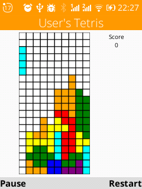

# User-s-Tetris
One-screen tetris player for KaiOS, A web-version for PC browsers is also avaiable at [my website](https://twester.tk/tetris.html)  

## Install

### Omni SD
The app is distributed in OmniSD/Gerda package format. Just download the latest release and install with OmniSD

### Web IDE
- Download the latest release
- unzip tetris.zip
- unzip tetris.zip
- Open WebIDE
- Click "Open Packaged App" and select the application folder
- Click "Install and Run" button (the triangle).

# Donation
Any and all donations are very much appreciated, but no one should ever feel obligated to donate.
Donations go trough [my website](https://twester.tk/ssg/donations.html)

Everything is apreiciated
